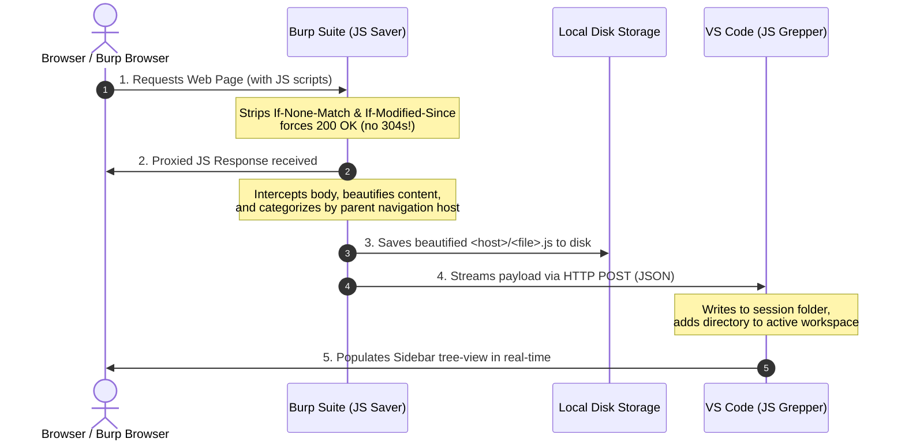

# ⚡ JS Grepper & JS Saver

A seamless, real-time pipeline to capture, beautify, and analyze JavaScript files proxied through Burp Suite directly inside VS Code. 

This repository contains two cooperative tools:
1. **JS Saver (Burp Suite Extension)**: A Java-based Burp Suite extension that intercepts HTTP responses, extracts JavaScript, strips query parameters, auto-beautifies the content, saves files locally, and streams them in real-time via an HTTP POST.
2. **JS Grepper (VS Code Extension)**: A lightweight VS Code companion extension that starts an internal HTTP listener to receive beautified scripts, maps them to a responsive sidebar tree view categorized by host, and automatically mounts them into the active VS Code workspace—enabling instant global searches, diffing, and analysis by AI coding agents.

---

## 🏗️ How It Works (The Pipeline)



---

## ✨ Features

- ⚡ **Real-time Pipeline**: JavaScript files arrive in VS Code within milliseconds of being loaded in your browser.
- 🧹 **Automatic Beautification**: Bundles a fully local, high-performance JS beautifier to unpack minified or obfuscated sources instantly.
- 🧠 **Smart Context Mapping**: Third-party scripts (e.g., CDNs, widgets, auth providers) are grouped under the host directory of the *top-level page* that loaded them, keeping your workspace neat and highly contextual.
- 🎯 **No More 304s (Cache Busting)**: Automatically strips conditional request headers (`If-None-Match`, `If-Modified-Since`) from JS loads, ensuring the server always responds with a `200 OK` and a full body instead of an empty `304 Not Modified`.
- ⚙️ **Ultra-light VS Code Extension**: Pure JavaScript with zero heavy external dependencies. It automatically mounts directories inside your VS Code workspace to facilitate instantaneous searching and interaction.

---

## 🛠️ Build & Installation

### 📋 Prerequisites
* **Java Development Kit (JDK) 11** or newer (installed and on your system `PATH`)
* **VS Code** (or VSCodium)
* **Burp Suite** (Community or Professional)

### 1. Build the Extension Binaries
Run the included build script to compile the Java project, bundle external dependencies into a fat JAR, and package the VS Code extension into a `.vsix` file:

```bash
chmod +x build.sh
./build.sh
```

Upon successful completion, you will have:
- `JsSaver.jar` — The Burp Suite Extension fat JAR.
- `vscode-extension/js-grepper-0.2.0.vsix` — The VS Code Extension installer.

---

### 2. Install the Burp Suite Extension
1. Open Burp Suite.
2. Go to **Extensions** ➡️ **Installed** ➡️ **Add**.
3. Set Extension Type to **Java**.
4. Select the built `JsSaver.jar` file from the project root.
5. Click **Next** to load it. You will see a new **⚡ JS Saver** tab appear in the Burp header.

---

### 3. Install the VS Code Extension
You can install the extension using the quick script or manually:

#### Option A: Quick Script (macOS/Linux)
Simply run the installer script inside the extension directory:
```bash
bash vscode-extension/install.sh
```
Then restart VS Code or open the Command Palette (`Cmd+Shift+P` / `Ctrl+Shift+P`) and execute `Developer: Reload Window`.

#### Option B: Manual VSIX Install
1. Open VS Code.
2. Open the Extensions sidebar (`Cmd+Shift+X` / `Ctrl+Shift+X`).
3. Click the **three dots** (`...`) in the upper-right corner.
4. Select **Install from VSIX...**.
5. Select `vscode-extension/js-grepper-0.2.0.vsix` from your filesystem.

---

## 🚀 Usage Guide

1. **Configure VS Code**:
   - In VS Code, verify the **JS Grepper** icon is visible in your Activity Bar.
   - By default, it starts a local HTTP listener on port `7777`. If you need to change this, go to Settings and search for `jsGrepper.port`.
   - Ensure you define your desired session folder via the `jsGrepper.sessionDir` setting (defaults to `~/js-grepper`).

2. **Configure Burp**:
   - Go to the **⚡ JS Saver** tab in Burp.
   - Choose your save directory (make sure it matches or points to the directory specified in VS Code).
   - Toggle the **▶ Enable** button to start intercepting JavaScript.
   - Toggle the **⚡ Send to VS Code** button to enable real-time streaming, and ensure the port is matching (e.g., `7777`).

3. **Start Grepping**:
   - Configure your browser to proxy through Burp Suite (or use Burp's built-in browser).
   - Navigate to any web application.
   - Watch the captured, beautified scripts populate your VS Code workspace and sidebar tree-view in real-time!
   - Perform a global search (`Cmd+Shift+F`) inside VS Code to quickly grep for API routes, tokens, endpoints, or hidden logic across all collected files.

---

## 🔒 Security & Privacy Notice
- **Local Network Only**: All communications between the Burp Suite extension and the VS Code extension happen strictly on `127.0.0.1` (localhost). No data is sent over the internet.
- **Ignore Local Folders**: Ensure you do not commit your local `js-grepper` or `js_saved` folders to public git repositories, as they contain cached JavaScript files from your active pentesting/research sessions which may contain sensitive vendor endpoints or session details.

---

## 📄 License
This project is open-source and available under the **MIT License**.
