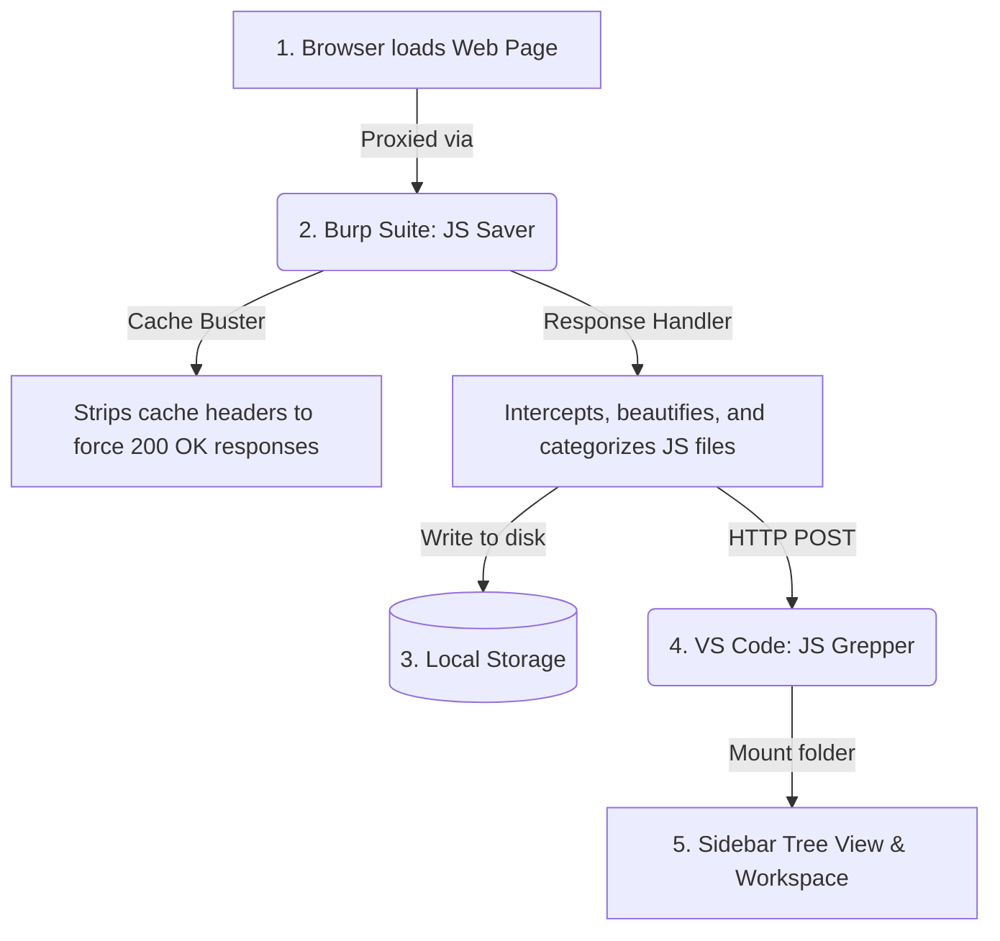

# JS Grepper & JS Saver

A real-time pipeline to capture, beautify, and analyze JavaScript files proxied through Burp Suite directly inside VS Code.

This repository contains two cooperative tools:
1. **JS Saver (Burp Suite Extension)**: A Java-based Burp Suite extension that intercepts HTTP responses, extracts JavaScript, strips query parameters, auto-beautifies the content, saves files locally, and streams them in real-time via HTTP POST.
2. **JS Grepper (VS Code Extension)**: A lightweight VS Code companion extension that starts an internal HTTP listener to receive beautified scripts, maps them to a responsive sidebar tree view categorized by host, and automatically mounts them into the active VS Code workspace—enabling instant global searches, diffing, and analysis.

---

## How It Works (The Pipeline)



---

## Features

- **Real-time Pipeline**: JavaScript files arrive in VS Code within milliseconds of being loaded in your browser.
- **Automatic Beautification**: Bundles a fully local, high-performance JS beautifier to unpack minified or obfuscated sources instantly.
- **Smart Context Mapping**: Third-party scripts (e.g., CDNs, widgets, auth providers) are grouped under the host directory of the top-level page that loaded them, keeping your workspace neat and highly contextual.
- **No More 304s (Cache Busting)**: Automatically strips conditional request headers (`If-None-Match`, `If-Modified-Since`) from JS loads, ensuring the server always responds with a `200 OK` and a full body instead of an empty `304 Not Modified`.
- **Ultra-light VS Code Extension**: Pure JavaScript with zero heavy external dependencies. It automatically mounts directories inside your VS Code workspace to facilitate instantaneous searching and interaction.

---

## Build & Installation

### Prerequisites
* JDK 11 or newer
* Burp Suite & VS Code

### Build
Run the build script in the project root:
```bash
chmod +x build.sh && ./build.sh
```
This generates:
- `JsSaver.jar` (Burp extension fat JAR)
- `vscode-extension/js-grepper-0.2.0.vsix` (VS Code extension VSIX)

### Install
1. **Burp Suite**: Add `JsSaver.jar` in **Extensions** -> **Installed** -> **Add** (Java).
2. **VS Code**: Drag and drop the built `vscode-extension/js-grepper-0.2.0.vsix` file directly into your VS Code window.

---

## Usage

1. In Burp Suite, open the **JS Saver** tab, choose a directory to save scripts, and enable both **Enable** and **Send to VS Code**.
2. In VS Code, verify the **JS Grepper** listener is running (default port is `7777`).
3. Browse websites using Burp's browser. JavaScript resources will automatically populate in your VS Code sidebar and workspace in real-time.

---

## License
This project is open-source and available under the **MIT License**.
